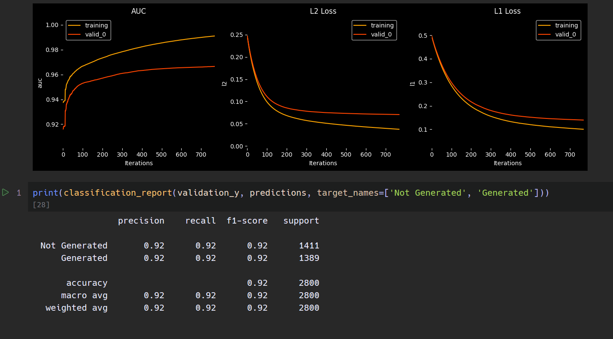

 # AI or Human

 AI or Human is a Python project to detect whether a text sample is generated by AI or written by a human. It provides feature extraction, utility functions, and sample scripts to train and evaluate models.

 ## Features

 - Feature engineering in `features.py`
 - Utility functions in `utils.py`
 - Sample script: `sample.py`
 - Jupyter notebook: `detector.ipynb`

 ## Extracted Features

 The following text features are computed in `features.py`:

 - `uniq_words_ratio`: Ratio of unique words to total words (lexical diversity).
 - `mean_word_length`: Average word length after stripping punctuation.
 - `word_length_variance`: Variance of word lengths.
 - `function_word_ratio`: Proportion of function words.
 - `punct_density`: Punctuation density (punctuation chars / total chars).
 - `punct_diversity`: Punctuation diversity (unique punctuation types / total punctuation).
 - `rare_word_frequency`: Percentage of rare, sophisticated content words.
 - `modal_verb_patterns`: Variety of modal verbs used.
 - `subordinate_clause_ratio`: Ratio of subordinate clauses to total clauses.
 - `transition_word_overuse`: Percentage of sentences starting with transition words.
 - `mean_syllables_per_word`: Average syllables per word.
 - `hedging_language_ratio`: Percentage of hedging language usage.
 - `sentence_length_variance`: Variance and mean of sentence lengths.
 - `grammar_issues_per_100_words`: Grammar issues per 100 words.

## Results: 



 ## Installation

1. Clone the repository:
```bash
git clone https://github.com/SergeySetti/ai-or-human.git
cd ai-or-human
```
2. (Optional) Create and activate a virtual environment:
```bash
python3 -m venv venv
source venv/bin/activate
```
3. Install dependencies:
```bash
pip install -r requirements.txt
```

 ## Usage

Run the sample script to extract subset form the large dataset
 ```bash
 python sample.py
 ```

Run the feature extraction script to compute features for the dataset:
 ```bash
python features.py
```

 Open `detector.ipynb` to play with the model training and evaluation in Jupyter Notebook.

 ## Data

Data files are located in the `data/` directory, including `AI_Human.csv` and processed Parquet files. Dataset used: https://www.kaggle.com/code/syedali110/ai-generated-vs-human-text-95-accuracy/input?select=AI_Human.csv

 ## License

 This software is proprietary and closed source. All rights reserved.

 Copyright (c) 2025 Serhii Kirichko.
